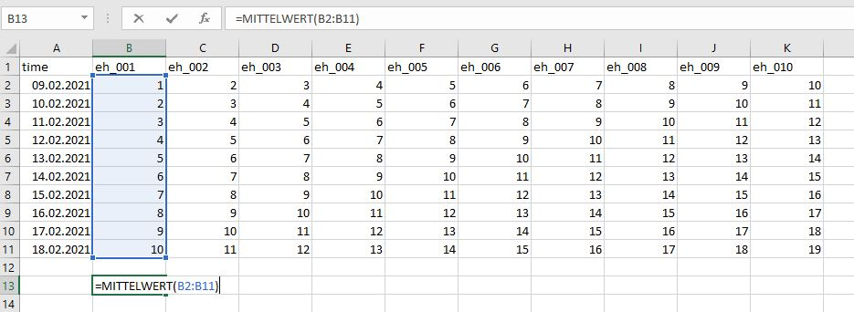
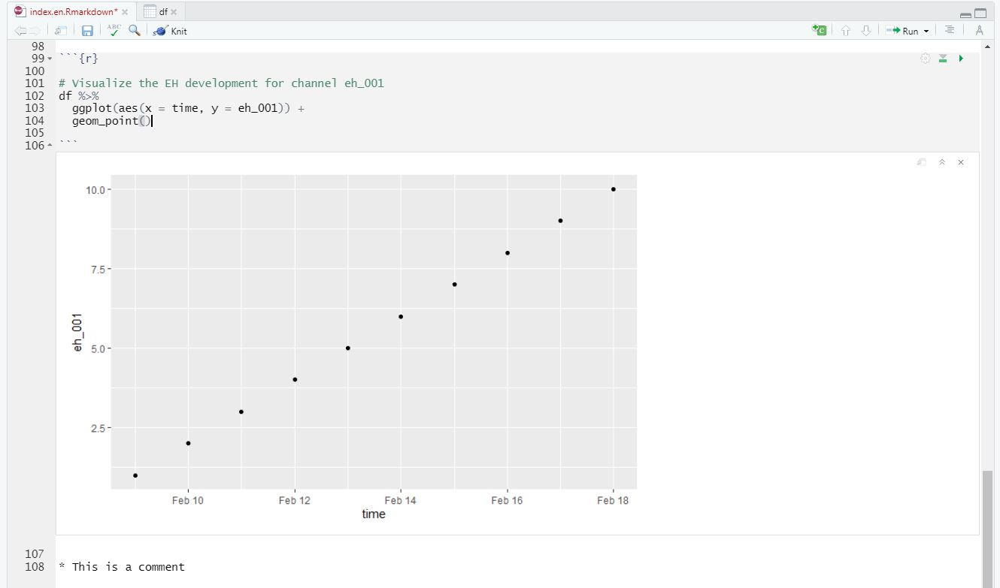

```{r echo = FALSE, error=FALSE, include = FALSE}

library(tidyverse)
library(markdown)  
library(knitr)
library(matrixStats)
library(patchwork)
library(lubridate)
library(plotly)
library(naniar)   # visualizes missing values (NA) with function vis_miss()
library(stlplus)
library(gt)           # Customize tables
library(dygraphs)     # creates interactive images
library(htmltools)    # creates multiple dygraphs within one image
library(zoo)          # time series analysis
library(xts)          # time series analysis
library(ggpmisc)
library(forcats)      # Orders factor levels according to value
library(RColorBrewer) # Visualize the stripes
library(Kendall)
library(rstudioapi)
library(kableExtra)
library(widgetframe)
library(htmlwidgets)

## The theme must be in FRONT (!) of all ggplot or it will be overwritten
my_theme <- theme(
  panel.background = element_rect(fill = "white", color = "black"),
  panel.grid.major = element_blank(), 
  panel.grid.minor = element_blank(), 
  panel.border = element_blank())

```


Hi 👋, and welcome to my first post. A first post on a blog might be similar to the first article being published. It feels like a long and stony way but you are super satisfied after you successfully managed to get it done. Two things paved my way for this site and my first post:

* **First** Corona hit everybody hard in Europe and the world in early 2020. Specifically in my case, I spent even more time in home-office than before and lab work was forced to rest. What to do? This was the starting point to use my time and learn R. What should I say...since then, I absolutely fell in love with it 😍

* **Second** A colleague ([Harald](https://www.thm.de/lse/harald-weigand)) had the idea to create a "redox-net", a panel to exchange about redox measurements in soils (to say it with his words in german: "um einen Pflock einzuschlagen").

So...here we are 😄

I will give you five reasons to learn R and employ it for your environmental studies, in contrast of using excel anymore (my impression and in random order).  

> **1. A script in R will win over embedded formulas in excel**

What does this mean. Well, this is a super simple example but imagine you want to calculate the mean from a time series of E~H~ measurements. In excel, your formula to do so  is embedded within the cell and not visible for peers. If you have complicated multi-step tasks to solve this is hard to digest. 

  

The user interface of R (or from RStudio, which is a development environment for R) works different. You have both the ability to write code and comment at each step what your are doing. 


```{r}

# This command reads the data 
df <- readr::read_delim("data.csv", delim = ";",
                  col_types = 
                    cols(
                      # This command tells R to format the time column
                      time = col_datetime(format = "%d.%m.%Y %T")
                    ))

# This command calculates the mean and the standard deviation from the column value
df %>%
  summarise(mean_ts = mean(eh_001),
            sd_ts = sd(eh_001))

```

Your comments in R are separated from the code with **#**. So when you run the code, it will neglect all parts that start with **#**. Et voila, you calculated your value with 5.5 ± 3.03 🎉

You think "I am still faster in excel"? 🤷️ One of the superpowers of R comes into play if you have up to 1000 columns that contain a distinct character in their column names (most of my posts will be about redox so let's assume you have time series data of 10 redox channels (or  a thousand more) from a data logger labeled from **eh_001** to **eh_010**). By adjusting the code above to:  

```{r}
# Calculate the summary statistics with the mean, standard deviation (sd), 
# minimum (min) and maximum (max)
# for the columns from eh_001 to eh_010
df %>%
  summarise_at(vars(eh_001:eh_010), list(mean = mean, 
                                         sd = sd, 
                                         min = min, 
                                         max = max)) %>% head()

```

This gives you the summary statistics of all your 10 channels. It looks awkward right now but there are various ways to create beautiful tables from this data frame (or more precisely called a **tibble** in R). Your are impressed? We can make it even shorter with:

```{r}

# Plot the summary statistics for the data table "df" including all channels
summary(df)

```

Boom ... 💪 `summary(XY)`will give you everything you want to have. It is as simple as pretty. 

> **2. Speed up your reporting** 

Delivering a report to your boss or co-authors and update them about a running experiment is a common task. However, if the origin of your data changes, e.g. your time series of the experiment develops, you are in trouble if you have to do the report on a weekly basis. Doing the statistics and the visualisation in excel, export the graphics to a word document, and finally comment the outcome will take some time. Why has the use of R advantages:  
The **rmarkdown** package enables a dynamic reporting where you can include the so-called "code chunks" (in between the notation ```{r} ````) and comment on them (see below).
Everytime you change the data and run the script, it will automatically update each and every figure or summary table. 
Trust me, if you have time series data up to 10 years from 50 channels you can end up easily with ~200k observations. **rmarkdown** makes reporting way easier if you, for instance, want to include the 11th year from your field measurements. 



> **3. A package for everybody**

The community of R users is steadily growing and with this development the amount a packages is growing as well. What is a package? To state it with Hadley Wickhams words (he is chief-scientist at RStudio and one of the main reasons why RStudio became so popular): 

> "An R package is a collection of functions, data, and documentation that extends the capabilities of base R. Using packages is key to the successful use of R." 

(from  [r4ds](https://r4ds.had.co.nz/))

I guess the book r4ds is the bible for data scientists just as is the [Bodenkundliche Kartieranleitung](https://de.wikipedia.org/wiki/Bodenkundliche_Kartieranleitung) (source: Wikipedia) for soil scientists in Germany 😄

One example to highlight what I mean: 

The Penman-Monteith equation is used to calculate the reference evapotranspiration according to FAO. A variety of meteorological parameters are included inside the equation, which makes it highly vulnerable if you do the calculation manually (e.g. with excel) (source: [Wikipedia](https://en.wikipedia.org/wiki/Penman%E2%80%93Monteith_equation)). 


Fortunately, the **Evapotranspiration** package [Link](https://cran.r-project.org/web/packages/Evapotranspiration/index.html) enables modeling of actual, potential and reference crop evapotranspiration. Implementing the script and functions within the package potentially reduces the possibility for errors, while simultaneously enhancing flexibility in the choice of your model.


> **4. Customize your (multipanel) plots**

We have already seen an example of a created plot above. I think it is amazing how flexible you are to customize your plots. The most popular package is called **ggplot2**. You can easily manipulate your labels and titles, scale your x- and y-axis, try different geoms, and so on. I greatly recommend the contribution from Cédric Scherer on [beautiful plotting in R](https://www.cedricscherer.com/2019/08/05/a-ggplot2-tutorial-for-beautiful-plotting-in-r/) and [the evolution of a ggplot](https://www.cedricscherer.com/2019/05/17/the-evolution-of-a-ggplot-ep.-1/) to get an impression what I am talking about 🔥


```{r message = FALSE, echo = FALSE}

# basic
p1 <- df %>%
  ggplot(aes(time, eh_001)) +
  geom_point() +
labs(
  title = "Basic"
)

# Axis labels
p2 <- df %>%
  ggplot(aes(time, eh_001)) +
  geom_point() +
labs(
  title = "+ axis labels",
  x = "Time (days)",
  y = expression(paste("E"[H], " (mV)"))
    )

# custom theme
p3 <- df %>%
  ggplot(aes(time, eh_001)) +
  geom_point() +
labs(
  title = "+ custom theme",
  x = "Time (days)",
  y = expression(paste("E"[H], " (mV)"))
    ) +
  my_theme

# add a geom
p4 <- df %>%
  ggplot(aes(time, eh_001)) +
  geom_line() +
  geom_point(shape = 21, fill = "white", size = 3) +
labs(
  title = "+ add a line",
  x = "Time (days)",
  y = expression(paste("E"[H], " (mV)"))
    ) +
  my_theme

p5 <- df %>%
  ggplot(aes(time, eh_001, color = eh_001)) +
  geom_line(size = 3) +
  geom_point(shape = 21, fill = "white", size = 3) +
labs(
  title = "+ add a line",
  x = "Time (days)",
  y = expression(paste("E"[H], " (mV)"))
    ) +
  scale_color_viridis_c() +
  my_theme


(p1 + p2) /
  (p3 + p4) /
  p5

```

Previously, I worked with a different visualisation software and the alignment of multipanel plots was tedious and cumbersome. However, the package **patchwork** in R makes the arrangement of multiple plots so easy that it still makes me smile.

> **5. Spent your money for charity, vacations, or whatever you desire**

Tools for exploratory data analysis and visualization usually cost a lot of money. Sometimes you do not even get a full license but instead only a 1-year permission to use a certain software. R is, and as far as I can tell will be, free of charge and I think this makes it highly versatile to learn it. If you move the company or position at university, you might lose the permission of a software you are already used to. This will not happen if you can take your R and RStudio software and re-download it as often as you want. In addition, there are a variety of sources and platforms who offer support if you run into trouble with your R project. One platform where you can find help is the site [stackoverflow](https://stackoverflow.com/questions/tagged/r). From my experience, the community is super fast, friendly and will offer help for your very specific R problems.

Overall, these are my individual top five why I think R is a thing you should keep in mind for doing your exploratory data analysis over excel. I hope you liked it and would love to hear your thoughts. 

Cheers

Kristof