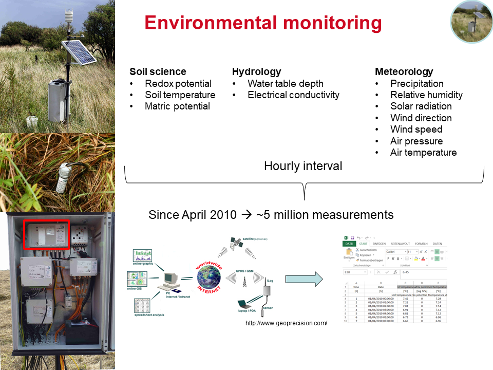

*The post was last updated on `r format(Sys.Date(), "%Y-%m-%d")`.*

<style>
p.caption {
  font-size: 0.6em;
}
</style>


```{r echo = FALSE, message = FALSE}

knitr::opts_chunk$set(warning = F, echo = F, error = F, message = F)

library(tidyverse)
library(widgetframe)
library(timevis)
library(patchwork)
library(rmarkdown)
library(kableExtra)
library(forcats)
library(ggrepel)

## The theme must be in FRONT (!) of all ggplot or it will be overwritten
my_theme <- theme(
  panel.background = element_rect(fill = "white", color = "black"),
  panel.grid.major = element_blank(), 
  panel.grid.minor = element_blank(), 
  panel.border = element_blank())


```

Some of the data that I will discuss within the redox section is originally from a site in Northern Germany - **Polder Speicherkoog**. [Tim](https://geographie.uni-koeln.de/forschung/arbeitsgruppen/bodengeographie-bodenkunde/mitarbeiter/mansfeldt-tim) conducted some of his first experiments at this site with Pt electrodes that were continuously deployed for a 20-month period. In 1989, little was known whether self-constructed redox electrodes are capable to get proper data for such a long period ( 👉️ [see the article](https://onlinelibrary.wiley.com/doi/abs/10.1002/jpln.19931560403)). 

<p align="center">

</p>

Since 1989, a lot of things with regard to E~H~ measurements evolved. We don't need to go once a week to the field, independent of the weather⛈️ , and storing data on a drive is no issue anymore. Meanwhile, we can sit in our cosy chair, drink ☕ and enjoy the benefits of automatic data logging, data transmission via GPRS and downloading data from a webserver. The temporal interval is also not an issue anymore (daily, hourly, every minute...you name it). 

Since April 2010, we measure a variety of parameters at Polder Speicherkoog (see sketch below). The measurement depths are in 10, 20, 40, 60, 100 and 150 cm soil depth. The spatial resolution to determine redox dynamics over time is quit high, even though when dealing with E~H~ you would love to have electrodes installed every cm 😎 I guess costs and feasibility of this wish render it impossible and we have to wait for another decade to solve some of the mysteries about spatial heterogeneity. 



What makes this site particularly interesting with respect to redox dynamics?!

First of all, it features intense water table draw downs in the summer time while the water table is very high at the surface during the winter time. Two meters of water table decline is intense. 

```{r}

koog <- readr::read_delim("data.csv", delim = ";",
                          col_types = cols(
                          # col_datetime parse the input character representations to a date/time
                          # POSIXct stores seconds since UNIX epoch (+some other data)
                          # POSIXlt stores a list of day, month, year, hour, etc.
                          date = col_datetime(format = "%d.%m.%Y %T")
                        ))

# Adds + 207 mV to all columns that start with EH
koog <- koog %>%
  mutate(across(contains("EH"), ~. +207)) # The tilde is used for a statistical model (left side is response and right is explanatory variables)

# Adds a timestamp for daily, monthly, and yearly data aggregation
koog <- koog %>%
  mutate(day = as.Date(format(date, "%Y-%m-%d")),
         month = format(date, "%m"),
         year = format(date, "%Y")
         )

# Aggregate the hourly data into daily data
dh_daily <- koog %>%
  group_by(day, month, year) %>%
  summarise_if(is.numeric, mean, na.rm = T) # only summarizes numeric values by mean)

# R want to have the data in a long format rather than a wide format that most are more familiar with (e.g. by working with excel, origin, etc.)
dh_long <- dh_daily %>%
  pivot_longer(contains("EH"), names_to = "EH", values_to = "value_EH")

# We can manually specify the order of factors by ft_relevel from the forcats package
dh_long <- dh_long %>%
   mutate(EH = fct_relevel(EH, "EH10a","EH10b","EH10c",
                                     "EH20a","EH20b","EH20c",
                                     "EH30a","EH30b","EH30c",
                                     "EH60a","EH60b","EH60c",
                                     "EH100a","EH100b","EH100c",
                                     "EH150a","EH150b","EH150c"))

dh_long %>%
  ggplot(aes(day, WT)) +
  geom_line() +
  facet_wrap(~year, scales = "free_x") +
  labs(
    title = "Water table depth development from 2010-2020",
    x = "Time", 
    y = "Water table depth (cm below ground)"
  ) +
  scale_x_date(date_labels = format("%m"), date_breaks = "2 months") +
  my_theme

```

Second, with the declining water table oxygen is capable to diffuse downwards the soil profile and facilitate oxidizing conditions over time. The soil profile, which is a Calcaric Gleysol (Kalkmarsch in the German classification and [soil of the year 2009](https://boden-des-jahres.de/wp-content/uploads/2014/09/2009_Faltblatt.pdf)), is differentiated in a part that is **continuously oxidizing** in the topsoil (10/20/30 cm depth), **temporarily reducing** in the intermittent soil profile (60/100 cm depth), and **continuously reducing** in the subsoil (150 cm depth; only the depths in 10/60/150 cm are shown for a better overview).

```{r}

dh_long %>%
  filter(EH %in% c("EH10a","EH60a", "EH150a")) %>%
  ggplot(aes(day, value_EH, color = EH)) +
  geom_line() +
  facet_wrap(~EH, scales = "free_x", nrow = 3) +
  labs(
    title = "Redox potential development from 2010-2020",
    x = "Time", 
    y = "Redox potential (mV)"
  ) +
  scale_x_date(date_labels = format("%Y"), date_breaks = "1 year") +
  scale_color_discrete(name = "Depths", labels = c("10 cm", "60 cm", "150 cm")) +
  my_theme

```

As you can see, if the water table declines underneath the 60 cm depth the pores start to drain and the soil profile becomes successively aerated. In most cases, the E~H~ response is straightforward with short a delay ranging from some days to a couple of weeks. If you take a look at the water table in the summer of 2018 (which was above average warm 🔥 and I can tell, because we live in the top floor 😅 ), we have no response of the EH in 150 cm soil depth. Why is that ❓️ It is because the microorganisms in the soil consume the O~2~ (aerobic respiration) on the way from the soil surface towards the location where the Pt tip is positioned in 150 cm soil depth.  Even though the pores in the subsoil drained considerably, the voids are filled with CO~2~ and/or CH~4~ rather than O~2~. 

```{r}

dh_long %>%
  filter(EH %in% c("EH10a", "EH60b", "EH150a")) %>%
  ggplot(aes(WT, value_EH, color = EH)) +
  geom_point(shape = 21, fill = "white", alpha = 0.2) +
  geom_smooth(size = 2) +
  coord_cartesian(expand = FALSE) +
  labs(
    title = "Redox potential and water table interactions",
    subtitle = "The dashed line indicates when the water table drops below 60 cm\nThe colored lines are the smooth function (LOESS) across the data",
    x = "Water table (cm below ground)", 
    y = "Redox potential (mV)"
  ) +
  geom_vline(xintercept = -60, linetype = "dashed") +
  scale_color_discrete(name = "Depths", labels = c("10 cm", "60 cm", "150 cm")) +
  my_theme


```

This annual interplay of water table and E~H~ - driven by meteorological parameters such as evapotranspiration - has a profound impact on marsh ecosystems. If you are interested you can take a read of publications from this particular site 👇🏻 :

* [Redoxpotentialmessungen mit dauerhaft installierten Platinelektroden unter reduzierenden Bedingungen](https://onlinelibrary.wiley.com/doi/abs/10.1002/jpln.19931560403)
* [Niederschlags‐Chemismus und atmosphärische Element‐Deposition in einem an der Nordseeküste von Schleswig‐Holstein gelegenen Agrarökosystem](https://onlinelibrary.wiley.com/doi/10.1002/jpln.19971600402)
* [Organic sulfur forms in mineral top soils of the Marsh in Schleswig‐Holstein, Northern Germany](https://onlinelibrary.wiley.com/doi/10.1002/1522-2624%28200206%29165%3A3%3C255%3A%3AAID-JPLN255%3E3.0.CO%3B2-6)
* [In situ long‐term redox potential measurements in a dyked marsh soil](https://onlinelibrary.wiley.com/doi/abs/10.1002/jpln.200390031)
* [Redox potential of bulk soil and soil solution concentration of nitrate, manganese, iron, and sulfate in two Gleysols](https://onlinelibrary.wiley.com/doi/abs/10.1002/jpln.200321204)
* [Collecting in situ precipitated iron oxides in their natural soil environment](https://onlinelibrary.wiley.com/doi/abs/10.1002/jpln.201300184)
* [Comparison of redox potential dynamics in a diked marsh soil: 1990 to 1993 versus 2011 to 2014](https://onlinelibrary.wiley.com/doi/abs/10.1002/jpln.201600060)

