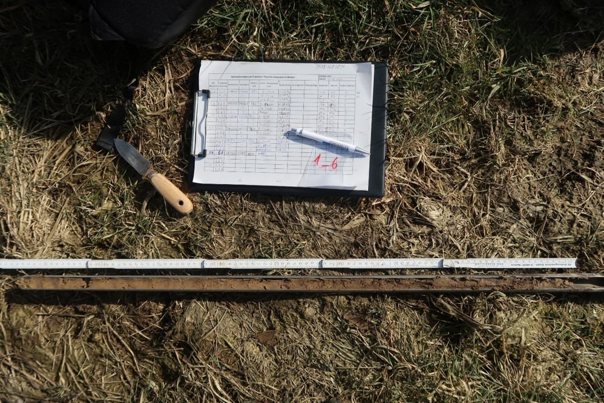

*The post was last updated on `r format(Sys.Date(), "%Y-%m-%d")`.*

<div style="text-align: justify">


```{r include=FALSE}

knitr::opts_chunk$set(fig.align = "center", collapse = T, echo = F, message = FALSE, warning = FALSE)

# With collapse = TRUE the Source and output lived together happily ever in knitr.
# https://github.com/yihui/knitr-examples/blob/master/039-merge.md

# loading multiple packages at once with `pacman`
# create a vector name
packages <- c("tidyverse", "markdown", "knitr", "matrixStats", "patchwork", "lubridate", "plotly",  "naniar", "stlplus", "gt", "dygraphs", "htmltools", "zoo", "xts", "ggpmisc", "forcats", "RColorBrewer", "Kendall", "rstudioapi", "multcompView", "plyr", "bookdown", "janitor", "rstatix", "ggpubr", "moments", "tweetrmd", "ggthemes", "hexbin", "ggridges", "ggstream", "openair", "treemapify", "MBA", "akima", "sf", "rnaturalearth", "rnaturalearthdata", "rgeos", "ggspatial", "factoextra", "FactoMineR", "gapminder", "ggforce", "gh", "globals", "openintro", "profvis", "RSQLite", "shiny", "shinycssloaders", "shinyFeedback", "shinythemes", "testthat", "thematic", "tidyverse", "vroom", "waiter", "xml2", "zeallot", "shiny", "rsconnect", "Evapotranspiration", "ggtext", "scales", "ggcorrplot", "pracma", "ggrepel", "aqp")
 
# Load the packages vector 
pacman::p_load(packages, character.only = T)

my_theme <- theme(
  panel.background = element_rect(fill = "white", color = "black"),
  panel.grid.major = element_blank(), 
  panel.grid.minor = element_blank(), 
  panel.border = element_blank())


```

The conservation area Bastauwiesen is a mesotrophic meadow fen and extends 11 km eastwards and 2 km soutwards in the district of Minden-Lübbecke, North-Rhine Westphalia. My first article was about wetland restoration measures from the fen "Bastauwiesen" ([Dorau et al. 2015](https://www.sciencedirect.com/science/article/abs/pii/S0925857415301233)). We investigated long term trends in water table depth development over 25 years at multiple wells within the study site. The organic rich soils of the fen are within the glacial valley of the River Weser with the basement composed of sandy to gravel Holocene deposits. South of the conservation area is the Wiehengebirge, which is the most northern summits of the Mittelgebirge. The soils at the ridge and along the slopes are mineral soils and the soil organic matter content (SOM) and the SOM stocks increase tremendously as closer you get to the wet but channelized Bastauwiesen fen. The soil properties vary a lot along a 3 km transect, which makes it a perfect location for training purposes to quantify SOM stocks in soils, discuss which processes ultimately results in SOM accrual in wetland soils, and, finally, visualize the data by maps.  

# Soil color

One of the most important properties to describe soils is soil color. We use the Munsell soil color chart to describe the color in a technical and at best reproducible way but without doubt, it needs some training to find the correct color. The color will change from a dry towards a wet soil and it should be mentioned on which sample the assessment was done. Three factors are important:

- Hue (specific color)
- Value (light vs dark)
- Chroma (color intensity)

For instance, the colors below denote three common Fe(III) oxides, humus and quartz, which are

- goethite, coarse (10YR 8/6)
- quartz (10YR 6/1)
- soil organic matter (10YR 2/1)
- ferrihydrite (2.5YR 3/6)
- hematite, fine (10R 4/8)

We need these information to quantify the soil organic carbon content of the soil. 


```{r fig.cap="Examples of soil color from different minerals and humus in soils. Source: aqp Package and nrcs.usda.gov"}
# Create soil color chart with aqp::contrastChart()
# aqp::contrastChart(m = "7.5YR 4/3", hues = c("5YR", "7.5YR", "10YR"))
aqp::colorChart(m = c("10YR 2/1", # Humus, pyrite, iron sulfide
                      "2.5YR 3/6", # ferrihydrite
                      "10R 4/8", # hematite-fine
                      "10YR 8/6", # goethite coarse
                      "10YR 6/1" # QUartz
                      ), chip.cex = 5, size = T)

```

# Texture

Soil texture is a mixture of the main group of particle sizes present in the soil: sand, silt and clay. It is one of the most important physical properties and determines the amount of water a soil can hold, its available plant water and many other related processes, such as nutrient storage. It can be estimated by hand or more precisely in the laboratory. Some behavior of the soil particles are the following (according to the german classification KA5):

```{r}
texture <- tribble(
  ~"Texture", ~"Soil code", ~"Behavior", ~"Clay content",
  "Pure sand", "Ss", "Coherence is nil, single grains visible", "< 5%",
  "Slightly clayey silt", "Ut2", "Barely visible grains, floury consitency", "8-12%", 
  "Pure clay", "Tt", "Plastic/sticky consistency, ribbon of 75 mm or more",  "65-100%"
)

kable(texture)

```

# Profile description

The Pürckhauer is a soil auger with a diameter of ~2 cm and typically a length of 1 m. The determination of soil color and texture according to different soil horizons can be done on soil taken from the auger. However, to separate the horizons and describe them is difficult in the field because in most cases a clear and distinct "boundary" is missing between individual soil horizons. 

> A soil horizon has physical, chemical and biological properties that differ from the horizon above or below. 

```{r fig.cap="Profile description with a Pürckhauer auger."}

```

# Calculation 

First of all, you need to derive the humus content based on the soil color and the texture. You can have a look at the description and look-up tables within the book KA5, which is the guide to german soil classification. If you want to get the soil organic carbon content (C~org~) instead of the humus content, you have to divide your values by the factor 1.72 (humus is composed by 58% on average by carbon following other elements, such as H, O, N, P, S, ...). 

```{r fig.cap="Estimation of humus content in soils. Source: KA5, S. 111, Tab. 14"}
include_graphics("table.jpg")
```

Finally, you need to sum up all the individual humus (or C~org~) contents and account for the bulk density. In most cases mineral soils have a lower bulk density with 1.2 g kg^-1^ compared with organic soils. If you have the individual density for each horizon this would be the best, otherwise you can estimate the density or assume an equal density throughout the soil profile.  

```{r}
include_graphics("calc.jpg")
```

Et voila, the hypothetical soil from the example would yield a SOM stock of ~7 kg C~org~ m^-²^ (up to 100 cm depth). 

```{r fig.cap="Some impressions"}
knitr::include_graphics(c("IMG_20220308_091617_1.jpg", "IMG_20220307_171946.jpg", "IMG_20220307_172013.jpg", "IMG_20220308_170634_13.jpg"))
```

