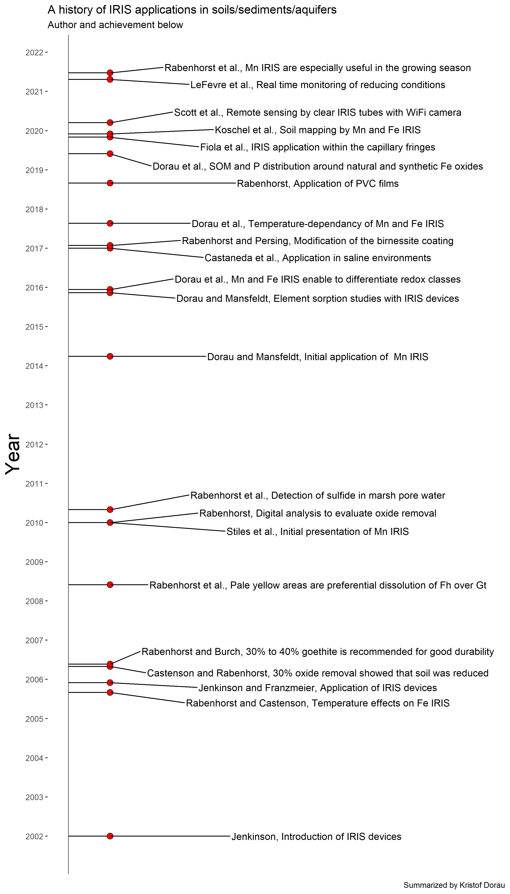

*The post was last updated on `r format(Sys.Date(), "%Y-%m-%d")`.*

<div style="text-align: justify">


```{r include=FALSE}

knitr::opts_chunk$set(fig.align = "center", collapse = T, echo = F, message = FALSE, warning = FALSE)

# With collapse = TRUE the Source and output lived together happily ever in knitr.
# https://github.com/yihui/knitr-examples/blob/master/039-merge.md

# loading multiple packages at once with `pacman`
# create a vector name
packages <- c("tidyverse", "markdown", "knitr", "matrixStats", "patchwork", "lubridate", "plotly",  "naniar", "stlplus", "gt", "dygraphs", "htmltools", "zoo", "xts", "ggpmisc", "forcats", "RColorBrewer", "Kendall", "rstudioapi", "multcompView", "plyr", "bookdown", "janitor", "rstatix", "ggpubr", "moments", "tweetrmd", "ggthemes", "hexbin", "ggridges", "ggstream", "openair", "treemapify", "MBA", "akima", "sf", "rnaturalearth", "rnaturalearthdata", "rgeos", "ggspatial", "factoextra", "FactoMineR", "gapminder", "ggforce", "gh", "globals", "openintro", "profvis", "RSQLite", "shiny", "shinycssloaders", "shinyFeedback", "shinythemes", "testthat", "thematic", "tidyverse", "vroom", "waiter", "xml2", "zeallot", "shiny", "rsconnect", "Evapotranspiration", "ggtext", "scales", "ggcorrplot", "pracma", "ggrepel")
 
# Load the packages vector 
pacman::p_load(packages, character.only = T)

my_theme <- theme(
  panel.background = element_rect(fill = "white", color = "black"),
  panel.grid.major = element_blank(), 
  panel.grid.minor = element_blank(), 
  panel.border = element_blank())

```

The principle of Indicator of Reduction In Soils tubes was proposed by Jenkinson and Franzmeier (2006) by using a synthetic Fe(III) oxide coating applied onto white PVC tubes. Rabenhorst and Co-Workers greatly extended this approach, e.g., by the use of defined Fe(III) oxide ratio with ferrihydrite/goethite and other ongoing applications. The tubes are inserted into the soil for a variable period (e.g., one month) and removed from the soil. If Fe reducing conditions are attained in the soil, the microbes will utilize the Fe(III) as terminal electron acceptor and reduce it to its solube counterpart Fe^2+^. Visibility of the white PVC underneath the orange-colored coating is therefore a sign for Fe(III) reduction that can be monitored by oxide removal. Oxide removal can have a linear pattern due to roots, a patchy pattern due to microsites in soils, or complete removal within a distinct soil horizon or due to the depth of the water table. 

```{r fig.cap="Application of IRIS devices for environmental monitoring. Adapted from [Dorau 2016. ](https://kups.ub.uni-koeln.de/7439/1/Dissertation_Dorau.pdf)"}
include_graphics("iris.jpg")
```

Generally, no oxide removal will occur if the soil is relatively dry and the soil pores are filled with O~2~. If this is the case, the microbes will utilize O~2~ instead of Fe(III). A wet soil, elevated soil temperatures and a high microbial activity will result in rapid Fe(III) removal. f

One of the biggest advantages of IRIS devices over the use of redox electrodes are to my impression:  

- **Costs**: The equipment to measure E~H~ can be cost intensive and to set up a monitoring campaign tedious. IRIS devices can be self manufactured and installed on a regular basis. 

- **Redox continuum**: IRIS devices reflect the distribution of soil reducing conditions over the complete PVC area in contact with the soil - a continuum - whereas E~H~ readings by Pt electrodes reflect discrete point measurements. This renders Pt electrodes more susceptible to soil heterogeneity and to a misinterpretation of E~H~ data, e.g., the Pt tip dips into a soil aggregate assuming reducing conditions in an already aerobic soil environment.

A major part of my PhD work was to extend the use of the classical IRIS approach by using manganese oxides (the synthesis is based upon the recipe by [Matthias Händel et al. 2013](https://www.sciencedirect.com/science/article/abs/pii/S0016706112003333)). The Mn oxide is a pure birnessite (δ-MnO~2~) and can be coated onto PVC tubes or films. The main advantage to use Mn IRIS is the differentiation of weakly and moderately reducing conditions, whereby the onset of Mn reduction is considered ecologically more relevant. "We recommend this  methodology  for  short-term  monitoring  because  tri-  and tetravalent  Mn  is  the  preferred  electron  acceptor  compared with  trivalent  Fe,  and  this  additionally  offers  the  possibility of  distinguishing  between  weakly  and  moderately  reducing conditions." [Dorau and Mansfeldt 2015](https://acsess.onlinelibrary.wiley.com/doi/abs/10.2134/jeq2014.03.0140) Especially the capillary fringe seems to be a zone, where Mn(III,IV) oxide removal is preferred over utilizing Fe(III) ([Dorau et al. 2016](https://link.springer.com/article/10.1007/s13157-015-0724-5); see scheme above and the mentioned article).  

IRIS tools can not only be used to monitor or identify reducing conditions. We utilized them to investigate the sorption behavior of elements from soil solution towards the Mn and Fe oxide surface, since the processes taking place along these synthetic surfaces are virtually the same that would occur under natural conditions. Afterwards, we were able to show that a preferential sorption occurs of, e.g., Cu > Pb > Zn towards the Mn oxide coating and As > P > Mo > V towards the Fe oxide coating. In addition, a scanning electron microscope (SEM) with energy-dispersive x-ray spectroscopy (EDX) enabled us to link minor depletion pattern of the coating with its elemental composition. 

```{r fig.cap="Application of IRIS devices for environmental monitoring. Detailed information can be found in: [Dorau and Mansfeldt 2016](https://link.springer.com/article/10.1007/s11368-015-1300-6)"}
include_graphics("rem.jpg")
```

The next step on our journey was to investigate the elemental fingerprint along the synthetic **AND** natural formed Fe oxides along the coating by nanoscale secondary ion mass spectrometry (NanoSIMS) with colleagues from the TU Munich ([Carsten Mueller](https://research.ku.dk/search/result/?pure=en%2Fpersons%2Fcarsten-mueller(138d0a3a-26ec-465d-9bbd-cbdd44e5b589).html), Lydia Pohl, Christopher Just and Carmen Höschen). This enabled us to study the distribution of Fe (^56^Fe^16^O^−^), SOM (^12^C^14^N^−^), and phosphorus (^31^P^16^O~2~^−^) at the microscale. "Image analysis of individual Fe oxide particles revealed a close association of Fe, SOM, and P resulting in coverage values up to 71%." "We conclude that both natural and synthetic Fe oxides rapidly sequester SOM and P (i.e., within 30 days) but that newly, natural formed Fe oxides sorbe more SOM and P than synthetic Fe oxides." (Dorau et al. 2019)

```{r fig.cap="Application of IRIS devices for environmental monitoring. Detailed information can be found in: [Dorau et al. 2019](https://pubs.acs.org/doi/10.1021/acs.est.9b03260)"}
include_graphics("sims.jpg")
```

Given the fact that IRIS tools are on the market since 2006, I expect that there is much more to come in the future. Stay tuned. A timeline of IRIS inventions and a list of publications related to IRIS that Tim and I were working on with colleagues and students from our group can be found below:

* [**Dorau, K.**, Pohl, L., Henke, C., Höschen, C., Ufer, K., Mansfeldt, T., Mueller, C.W. 2019. Soil organic matter and phosphate sorption on natural and synthetic Fe oxides under in situ conditions. Environmental Science & Technology, 53, 13081–13087.](https://pubs.acs.org/doi/10.1021/acs.est.9b03260)

* [**Dorau, K.**, Papenfuß, S., Mansfeldt, T., 2018. Temperature-dependent oxide removal from manganese- and iron oxide-coated soil redox bars. Journal of Soils and Sediments 18, 680-687.](https://link.springer.com/article/10.1007/s11368-017-1812-3)

* [**Dorau, K.**, Mansfeldt, T. 2015. Manganese and iron oxide-coated redox bars as a tool to study the in situ sorption behavior of elements in wet soils. Journal of Soils and Sediments 16, 976–986.](https://link.springer.com/article/10.1007/s11368-015-1300-6)

* [**Dorau, K.**, Eickmeier, M., Mansfeldt, T. 2015. Comparison of manganese and iron oxide-coated redox bars for characterization of the redox status in wetland soils. WETLANDS 36, 133–144.](https://link.springer.com/article/10.1007/s13157-015-0724-5)

* [**Dorau, K.**, Mansfeldt, T. 2015. Manganese-Oxide-Coated Redox Bars as an Indicator of Reducing Conditions in Soils. Journal of Environmental Quality 44, 696–703.](https://acsess.onlinelibrary.wiley.com/doi/10.2134/jeq2014.03.0140) 

```{r  echo = FALSE, message = FALSE, eval = F}
# Create data to plot
data <- tribble( ~year, ~event, ~displ,
                as.Date("2005-12-02"), "Jenkinson and Franzmeier, Application of IRIS devices", 0.1,
                as.Date("2002-01-01"), "Jenkinson, Introduction of IRIS devices ", 0.1,
                as.Date("2005-09-01"), "Rabenhorst and Castenson, Temperature effects on Fe IRIS", 0.1,
                as.Date("2006-05-01"), "Castenson and Rabenhorst, 30% oxide removal showed that soil was reduced", 0.1,
                as.Date("2006-05-23"), "Rabenhorst and Burch, 30% to 40% goethite is recommended for good durability", 0.1,
                as.Date("2008-06-01"), "Rabenhorst et al., Pale yellow areas are preferential dissolution of Fh over Gt", 0.1,
                as.Date("2010-01-01"), "Rabenhorst, Digital analysis to evaluate oxide removal", 0.1,
                as.Date("2010-05-01"), "Rabenhorst et al., Detection of sulfide in marsh pore water", 0.1,
                as.Date("2017-01-01"), "Castaneda et al., Application in saline environments", 0.1,
                as.Date("2017-01-26"), "Rabenhorst and Persing, Modification of the birnessite coating", 0.1,
                as.Date("2019-11-01"), "Fiola et al., IRIS application within the capillary fringes", 0.1,
                as.Date("2021-06-22"), "Rabenhorst et al., Mn IRIS are especially useful in the growing season", 0.1,
                as.Date("2020-03-15"), "Scott et al., Remote sensing by clear IRIS tubes with WiFi camera", 0.1,
                as.Date("2018-08-30"), "Rabenhorst, Application of PVC films", 0.1,
                as.Date("2021-04-22"), "LeFevre et al., Real time monitoring of reducing conditions", 0.1,
                as.Date("2014-03-30"), "Dorau and Mansfeldt, Initial application of  Mn IRIS", 0.1,
                as.Date("2015-12-12"), "Dorau et al., Mn and Fe IRIS enable to differentiate redox classes", 0.1,
                as.Date("2015-11-13"), "Dorau and Mansfeldt, Element sorption studies with IRIS devices", 0.1,
                as.Date("2017-08-21"), "Dorau et al., Temperature-dependancy of Mn and Fe IRIS", 0.1,
                as.Date("2019-05-31"), "Dorau et al., SOM and P distribution around natural and synthetic Fe oxides", 0.1,
                as.Date("2019-12-01"), "Koschel et al., Soil mapping by Mn and Fe IRIS", 0.1,
                as.Date("2010-01-01"), "Stiles et al., Initial presentation of Mn IRIS", 0.1,
)


# Plot the data
p <- data %>%
  ggplot(aes(x = displ, y = year, label = event)) +
  geom_segment(aes(y = year, yend = year, x = 0, xend = displ)) +
  geom_point(shape = 21, fill = "red", size = 3) +
  geom_text_repel(direction = "y", nudge_x = 0.5, stat = "identity") +
  geom_vline(xintercept=0, color = "black", size=0.3) +
  scale_y_date(date_labels = "%Y", date_breaks = "1 years") +
  coord_cartesian(xlim = c(0,1)) +
  labs(
    title = "A history of IRIS applications in soils/sediments/aquifers",
    subtitle = "Author and achievement below",
    caption = "Summarized by Kristof Dorau", 
    y = "Year"
  ) +
  theme(
    axis.title.y = element_text(size = 22),
    axis.title.x = element_blank(),
        axis.ticks.x = element_blank(),
        axis.line.x = element_blank(),
        axis.text.x = element_blank(),
        panel.background = element_rect("white")
        )

ggsave(plot = p, filename = "content/project/equip-iris/time.png", width = 8, height = 14)

```

```{r echo = F, fig.cap="Timeline of important findings related to the application of IRIS in soils"}

```

