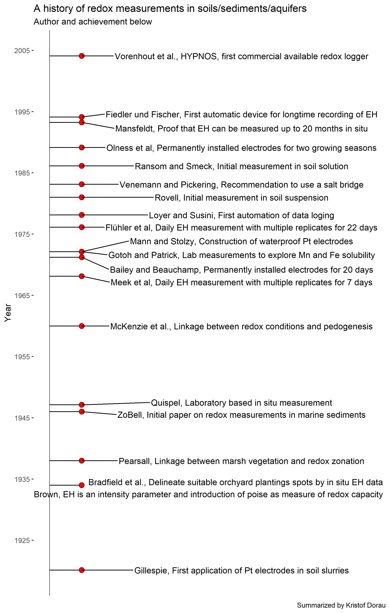

*The post was last updated on `r format(Sys.Date(), "%Y-%m-%d")`.*

<div style="text-align: justify">


```{r include=FALSE}

knitr::opts_chunk$set(fig.align = "center", collapse = T, echo = F, message = FALSE, warning = FALSE)

# With collapse = TRUE the Source and output lived together happily ever in knitr.
# https://github.com/yihui/knitr-examples/blob/master/039-merge.md

# loading multiple packages at once with `pacman`
# create a vector name
packages <- c("tidyverse", "markdown", "knitr", "matrixStats", "patchwork", "lubridate", "plotly",  "naniar", "stlplus", "gt", "dygraphs", "htmltools", "zoo", "xts", "ggpmisc", "forcats", "RColorBrewer", "Kendall", "rstudioapi", "multcompView", "plyr", "bookdown", "janitor", "rstatix", "ggpubr", "moments", "tweetrmd", "ggthemes", "hexbin", "ggridges", "ggstream", "openair", "treemapify", "MBA", "akima", "sf", "rnaturalearth", "rnaturalearthdata", "rgeos", "ggspatial", "factoextra", "FactoMineR", "gapminder", "ggforce", "gh", "globals", "openintro", "profvis", "RSQLite", "shiny", "shinycssloaders", "shinyFeedback", "shinythemes", "testthat", "thematic", "tidyverse", "vroom", "waiter", "xml2", "zeallot", "shiny", "rsconnect", "Evapotranspiration", "ggtext", "scales", "ggcorrplot", "pracma", "kableExtra", "ggrepel")

# Load the packages vector 
pacman::p_load(packages, character.only = T)

my_theme <- theme(
  panel.background = element_rect(fill = "white", color = "black"),
  panel.grid.major = element_blank(), 
  panel.grid.minor = element_blank(), 
  panel.border = element_blank())

```

This summary of the history of redox measurements (predominantly in soils) is based on literature I had cited previously. Please give me a note and I will edit the timeline with further findings if you wish. This overview focused on redox electrode but their are other tools that can be used to qualitatively (or quantitatively) to characterize or even monitor reducing conditions. These are:

* E~H~ measurements by redox electrodes  
* Dyes that indicate the presence of, e.g., Fe^2+^  
* IRIS tools (**I**ndicator of **R**eduction **I**n **S**oils) that indicate Mn and Fe reducing conditions by dissolution of synthetic minerals
* Others (e.g.) 
    + Iron metal rods
    + Terminal electron accepting processes (TEAPs) approach
    + Oxidative capacity (OXC) approach
    + ...

📚 More information with emphasis on technical advancements can be found in the PhD thesis from Sabine Fiedler:
Fiedler, S., 1997. In-situ-Langzeitmessungen des Redoxpotentials in hydromorphen Böden einer Endmoränenlandschaft im württembergischen Alpenvorland, Universität Hohenheim, Stuttgart.

The following static timeline (💯 % **ggplot**) is more general of the most important findings with major breakthroughs related to the platinum redox electrode:

```{r  echo = FALSE, message = FALSE, eval = F}
# Create data to plot
data <- tribble( ~year, ~event, ~displ,
                as.Date("1920-02-17"), "Gillespie, First application of Pt electrodes in soil slurries", 0.1,
                as.Date("1993-03-29"), "Mansfeldt, Proof that EH can be measured up to 20 months in situ", 0.1,
                as.Date("2004-02-01"), "Vorenhout et al., HYPNOS, first commercial available redox logger", 0.1,
                as.Date("1994-02-17"), "Fiedler und Fischer, First automatic device for longtime recording of EH", 0.1, 
                as.Date("1981-01-01"), "Rovell, Initial measurement in soil suspension", 0.1, # Summarized by Fiedler and Fischer 1994
                as.Date("1986-02-17"), "Ransom and Smeck, Initial measurement in soil solution", 0.1,
                as.Date("1947-02-17"), "Quispel, Laboratory based in situ measurement", 0.1,
                as.Date("1972-02-17"), "Gotoh and Patrick, Lab measurements to explore Mn and Fe solubility", 0.1,
                as.Date("1971-03-19"), "Bailey and Beauchamp, Permanently installed electrodes for 20 days", 0.1,
                as.Date("1989-02-17"), "Olness et al, Permanently installed electrodes for two growing seasons", 0.1,
                as.Date("1978-02-17"), "Loyer and Susini, First automation of data loging", 0.1,
                as.Date("1968-02-17"), "Meek et al, Daily EH measurement with multiple replicates for 7 days", 0.1,
                as.Date("1976-02-17"), "Flühler et al, Daily EH measurement with multiple replicates for 22 days", 0.1,
                as.Date("1983-02-17"), "Venemann and Pickering, Recommendation to use a salt bridge", 0.1,
                as.Date("1972-02-17"), "Mann and Stolzy, Construction of waterproof Pt electrodes", 0.1,
                as.Date("1946-01-01"), "ZoBell, Initial paper on redox measurements in marine sediments", 0.1,
                as.Date("1934-01-01"), "Brown, EH = intensity parameter and poise as measure of redox capacity", 0.1,
                as.Date("1934-01-01"), "Bradfield et al., Delineate suitable orchyard plantings spots by in situ EH data", 0.1,
                as.Date("1938-01-01"), "Pearsall, Linkage between marsh vegetation and redox zonation", 0.1,
                as.Date("1960-01-01"), "McKenzie et al., Linkage between redox conditions and pedogenesis", 0.1, 
                as.Date("2005-01-01"), "Jang et al., Miniaturized Redox Potential Probe of only 200 nm2", 0.1,
)


# Plot the data
p <- data %>%
  ggplot(aes(x = displ, y = year, label = event)) +
  geom_segment(aes(y = year, yend = year, x = 0, xend = displ)) +
  geom_point(shape = 21, fill = "red", size = 3) +
  geom_text_repel(direction = "y", nudge_x = 0.5, stat = "identity") +
  geom_vline(xintercept=0, color = "black", size=0.3) +
  scale_y_date(date_labels = "%Y", date_breaks = "5 years") +
  coord_cartesian(xlim = c(0,1)) +
  labs(
    title = "A history of redox measurements in soils/sediments/aquifers",
    subtitle = "Author and achievement below",
    caption = "Summarized by Kristof Dorau", 
    y = "Year"
  ) +
  theme(
    axis.title.y = element_text(size = 22),
    axis.title.x = element_blank(),
        axis.ticks.x = element_blank(),
        axis.line.x = element_blank(),
        axis.text.x = element_blank(),
        panel.background = element_rect("white")
        )

ggsave(plot = p, filename = "content/project/funda-time/time.png", width = 8, height = 14)

```

```{r echo = F, fig.cap="Timeline of important findings related to the measuring of redox potentials in soils"}

```

