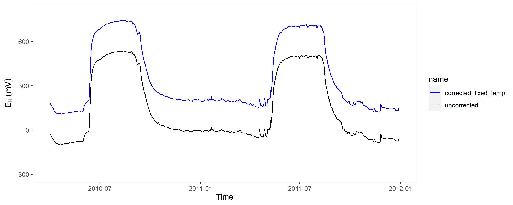
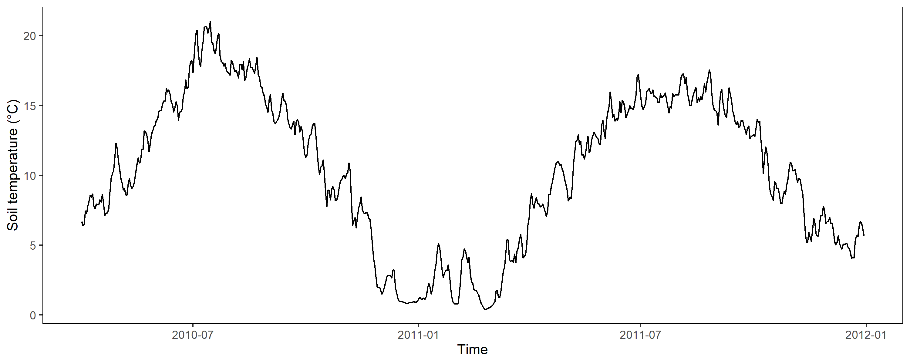
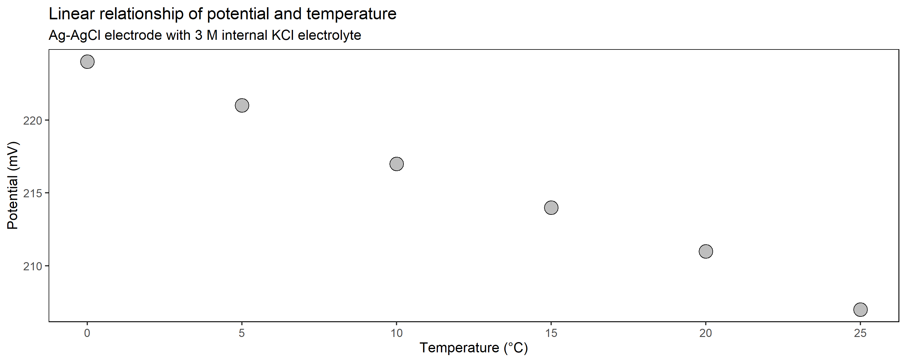
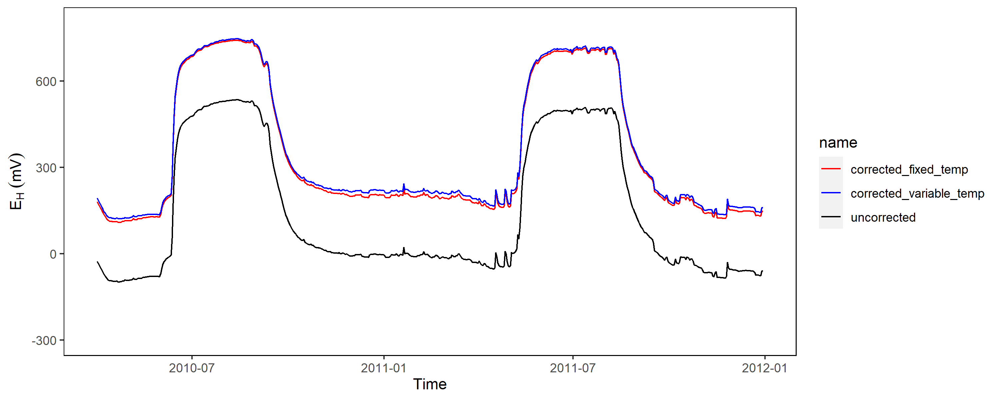

*The post was last updated on `r format(Sys.Date(), "%Y-%m-%d")`.*

<div style="text-align: justify">


```{r include=FALSE}

knitr::opts_chunk$set(fig.align = "center", collapse = T, echo = F, message = FALSE, warning = FALSE)

# With collapse = TRUE the Source and output lived together happily ever in knitr.
# https://github.com/yihui/knitr-examples/blob/master/039-merge.md

# loading multiple packages at once with `pacman`
# create a vector name
packages <- c("tidyverse", "markdown", "knitr", "matrixStats", "patchwork", "lubridate", "plotly",  "naniar", "stlplus", "gt", "dygraphs", "htmltools", "zoo", "xts", "ggpmisc", "forcats", "RColorBrewer", "Kendall", "rstudioapi", "multcompView", "plyr", "bookdown", "janitor", "rstatix", "ggpubr", "moments", "tweetrmd", "ggthemes", "hexbin", "ggridges", "ggstream", "openair", "treemapify", "MBA", "akima", "sf", "rnaturalearth", "rnaturalearthdata", "rgeos", "ggspatial", "factoextra", "FactoMineR", "gapminder", "ggforce", "gh", "globals", "openintro", "profvis", "RSQLite", "shiny", "shinycssloaders", "shinyFeedback", "shinythemes", "testthat", "thematic", "tidyverse", "vroom", "waiter", "xml2", "zeallot", "shiny", "rsconnect", "Evapotranspiration", "ggtext", "scales", "ggcorrplot", "pracma")
 
# Load the packages vector 
pacman::p_load(packages, character.only = T)

my_theme <- theme(
  panel.background = element_rect(fill = "white", color = "black"),
  panel.grid.major = element_blank(), 
  panel.grid.minor = element_blank(), 
  panel.border = element_blank())

# Read the data 
# dh_daily <- read_csv("content/project/intro-interpretation/koog_daily.csv")
dh_daily <- read_csv("koog_daily.csv")

```

```{r eval = F, echo = F}
# Uncorrected EAg-AgCl
dh_daily %>%
  select(day, E~H~100a) %>%
  filter(day < as.Date("2011-12-31")) %>%
  mutate(uncorrected = E~H~100a - 207) %>%
  ggplot(aes(day, uncorrected)) +
  geom_line() +
  labs(
    x = "Time", 
    y = expression(E[AgAgCl]~(mV))
  ) +
  coord_cartesian(ylim = c(-300, 800)) +
  my_theme

ggsave("content/project/inter-correction/uncorr.png", width = 10, height = 4)

# Corrected EAg-AgCl with fixed ref
dh_daily %>%
  select(day, E~H~100a) %>%
  filter(day < as.Date("2011-12-31")) %>%
  mutate(uncorrected = E~H~100a - 207, 
         corrected_fixed_temp = E~H~100a) %>%
  pivot_longer(cols = contains("corr")) %>%
  ggplot(aes(day, value, color = name)) +
  geom_line() +
  labs(
    x = "Time", 
    y = expression(E[H]~(mV))
  ) +
  coord_cartesian(ylim = c(-300, 800)) +
  scale_color_manual(values = c("blue", "black")) +
  my_theme

ggsave("content/project/inter-correction/corr_fixed.png", width = 10, height = 4)
  

# Correction line for temp
temp_line <- tribble(
  ~temp, ~pot, 
  0, 224,
  5, 221, 
  10, 217, 
  15, 214, 
  20, 211, 
  25, 207
)


temp_line %>%
  ggplot(aes(temp, pot)) +
  geom_point(shape = 21, fill = "grey", size = 5) +
  labs(
    title = "Linear relationship of potential and temperature", 
    subtitle = "Ag-AgCl electrode with 3 M internal KCl electrolyte",
    x = "Temperature (°C)", 
    y = "Potential (mV)"
  ) +
  my_theme

ggsave("content/project/inter-correction/equation.png", width = 10, height = 4)


temp_line_1M <- tribble(
  ~temp, ~pot, 
  0, 249,
  5, 247, 
  10, 244, 
  15, 242, 
  20, 240, 
  25, 244
)

lm(data = temp_line_1M, formula = pot ~ temp)


temp_line_sat <- tribble(
  ~temp, ~pot, 
  0, 221,
  5, 216, 
  10, 212, 
  15, 207, 
  20, 202, 
  25, 197
)

lm(data = temp_line_sat, formula = pot ~ temp)

# R square
cor(temp_line$temp, temp_line$pot)

# Regression equation
model <- lm(data = temp_line, formula = pot ~ temp)
model
# Extract the coefficients from equation
slope <- model$coefficients[2]
intercept <- model$coefficients[1]

# Soil temperature
dh_daily %>%
  select(day, st10) %>%
  filter(day < as.Date("2011-12-31")) %>%
  ggplot(aes(day, st10)) +
  geom_line() +
  labs(
    x = "Time", 
    y = "Soil temperature (°C)"
  ) +
  my_theme

ggsave("content/project/inter-correction/temp.png", width = 10, height = 4)

# Corrected E~H~ with variable temperature
dh_daily %>%
  select(day, E~H~100a, st10) %>%
  filter(day < as.Date("2011-12-31")) %>%
  mutate(uncorrected = E~H~100a - 207, 
         corrected_fixed_temp = E~H~100a, 
         corrected_variable_temp = (E~H~100a - 207) + intercept + (slope * st10)) %>%
  pivot_longer(cols = contains("corr")) %>%
  ggplot(aes(day, value, color = name)) +
  geom_line() +
  labs(
    x = "Time", 
    y = expression(E[H]~(mV))
  ) +
  coord_cartesian(ylim = c(-300, 800)) +
  scale_color_manual(values = c("red", "blue", "black")) +
  my_theme

ggsave("content/project/inter-correction/corr_variable.png", width = 10, height = 4)

```

Generally, redox data needs to be corrected relative to the potential of the standard hydrogen electrode (SHE). For instance, if a Ag-AgCl electrode with a 3 M KCl solution is used the deviation is 207 mV at 25 °C. This value needs to be added towards the potential by:

*E*~H~ = *E*~Ag-AgCl~ + 207

```{r}

```

Obviously, in most applications the reference electrode is positioned close to the soil surface (sometimes within a salt bridge) and therefore a constant factor of 207 mV is not really valid, since temperature fluctuations are common if you work outside the tropics. 

```{r}

```

As shown above with data from Polder Speicherkoog, the soil temperature in 10 cm depth is close to 0 °C during winter and up to 20 °C in the summer months. The relationship of temperature and potential from the reference electrode is linear and we should employ this into our correction factor to be more precisely:

```{r}

```

*E*~H~ = *E*~Ag-AgCl~ + intercept + (slope * soil temperature)

```{r}

```

The deviation is not much but if you have the temperature available, why should you not use it compensate technical issues being present in the data?! 

Below you can find the intercept and the slope from the linear model when you work with three common Ag-AgCl reference electrodes of variable internal electrolyte for your application:

```{r}
lin_models <- tribble(
  ~"Electrolyte solution", ~"Intercept", ~"Slope",
  "1 M", 247.76, -0.2743,
  "3 M", 224.09, -0.6743, 
  "Saturated", 221.09, -0.9543  
)

kable(lin_models)

```

Besides temperature effects a redox electrode will also respond to changes in pH, since E~H~ and pH are inversely related (pH increase = E~H~ decrease). Most researchers use the Nernst factor of 59 mV to correct for pH variability and adjust the data to pH 7, which is commonly employed in biological sciences and reflect the pH of plant and animal cells (Mansfeldt 2020). 

*E*~H7~ = *E*~H~ + (pH - 7) * 59

Although the Nernst factor of -59 mV per pH unit is reasonable for most applications it must be noted that other systems have variable factors. For instance, the number of electrons (*n*) and protons (*m*) when working with manganese oxides is *m/n* = 2 and when working with iron oxides is 3, which would make a conversion factor of -118 and -177 more applicable (see table below):

```{r }
redox <- tribble(
  ~"Reduction reaction", ~"*m/n*", ~"E~H~/pH (mV/pH unit", 
  "O~2~ + 4H^+^ + 4e^-^ = 2H~2~O", 1, 59,
  "NO; + 2H^+^ + 2e^-^ = NO~2~- + H~2~0", 1, 59,
  "2NO~3~- + 12H^+^ + 10e^-^ = N~2~ + 6H~2~0", 1.2, 78,
  "MnO~2~ + 4H^+^ + 2e^-^ = Mn^2+^ + 2H~2~O", 2, 118,
  "FeOOH + 3H^+^ e^-^ = Fe^2+^ + 2H~2~O", 3, 177,
  "Fe~3~(OH)~8~ + 8H^+^ + 2e^-^ = 3Fe^2+^ + 8H~2~0", 4, 236,
)

kable(redox, caption = "According to Mansfeldt 2020 and modified from Reddy and DeLaune 2018.")

```

Either way, whenever E~H~ is measured the pH should be measured and recorded.
